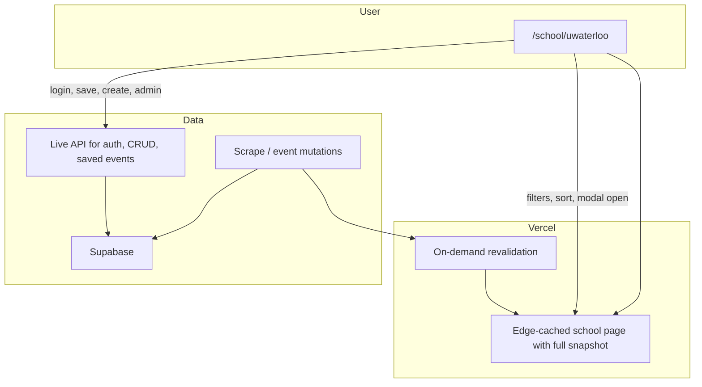

# Event Feed Caching Architecture

## Purpose

Wat2Do serves many schools via subdomains (for example `mit.wat2do.io`,
`uwaterloo.wat2do.io`) and may grow to hundreds of schools.
Each school exposes a browsable upcoming event feed - the highest-traffic read
path in the product.

This document defines how that feed is embedded into server-rendered school
pages, refreshed on demand, and filtered entirely on the client for public
browsing.

## Problem

The public events UI previously had two competing read paths.
The server embedded an initial feed into the route through ISR, but the client
also fetched `/events/` through TanStack Query whenever filters changed.
That duplicated filtering logic and added avoidable latency.

We need an architecture that:

- Scales to hundreds of schools without hundreds of deployments or a massive
  frontend bundle.
- Makes the school browse feed feel instant after first paint.
- Stays fresh when scrapes or manual edits add or update events.
- Keeps search, filters, sorting, promoted partitioning, and modal resolution
  on the embedded snapshot without browser refetches of `/events/`.
- Keeps authenticated and operational workflows on live backend APIs.

## Chosen Architecture

**Next.js on Vercel with ISR (Incremental Static Regeneration), on-demand
revalidation, and client-side derivation over the embedded school snapshot.**

One deployment serves all school subdomains.
Each school page loads the full browsable upcoming event set on the server,
embeds it into the HTML, and tags the response for on-demand revalidation.
The client hydrates that snapshot into the events store and derives filtered
results locally.

## Core Design Principles

### One deployment, many schools

Wildcard subdomains map to school context (same model as today).
No per-school Vercel projects.
No embedding all schools' data into one frontend bundle.

### Full school snapshot is pre-rendered

The complete browsable upcoming event list for a school is fetched on the server,
paged through the backend's maximum page size until all pages are collected,
and embedded into the route payload.
Promoted events for that school are loaded in the same server pass and hydrated
with the feed.

### Freshness follows data changes

When a scrape or other event mutation completes for a school, revalidation
refreshes that school's cached page.
Other schools are unaffected.

A conservative time-based fallback may exist as a safety net for missed
webhooks, but on-demand revalidation is the primary freshness mechanism.

### Client-side filtering for public browse

Search, filters, saved-only filtering, sorting, promoted partitioning, event
counts, and direct event modal resolution all derive from the hydrated snapshot.
Changing filters updates URL-backed state only.
The browser does not call `/events/` or `/events/promoted` during public
browsing.

### Live API for authenticated and dynamic workflows

Login, saved events sync, credits, event creation, event editing, event
deletion, reports, QR dashboards, admin pages, organization pages, and settings
continue to use live backend APIs.

### Feed metadata travels with the feed

Alongside `items`, the embedded snapshot includes the most recently added event
for that school: its title and `added_at` timestamp.
The homepage uses that metadata for copy such as "Hack the North added 22
minutes ago."
When a school's cache revalidates, the feed and this freshness metadata update
together.

## What We Are Not Doing

- **Per-filter server round-trips on the public browse path** - filters are a
  single client-side derivation over the embedded snapshot.
- **Infinite scroll pagination on the public browse path** - the client already
  has the full school snapshot after hydration.
- **Separate deployments per school** - unnecessary operational burden.
- **A dedicated route or fetch for "last added"** - metadata belongs on the
  default feed response.

## Tradeoffs

| Benefit | Cost |
|---|---|
| Fastest browse experience after hydration | Larger per-school HTML payload |
| Per-school freshness without full redeploys | Revalidation webhook and scrape integration |
| Lower API load on homepage views | Full school snapshot must fit acceptably in page payload |
| One filtering implementation path | Authenticated workflows still hit live APIs |

## Success Criteria

- A student landing on a school page sees events from the embedded snapshot
  without waiting on a live `/events/` call for browse interactions.
- After a scrape completes for that school, the cached page reflects new
  events within minutes, without redeploying the whole frontend.
- Filter, search, and sort changes do not call `/events/` or `/events/promoted`
  in the browser network panel.
- The "last added" line reflects the same cached snapshot as the feed.
- Architecture remains viable at hundreds of schools with one deployment.

## Summary

Serve each school's full browsable event snapshot from Vercel's edge cache via
Next.js ISR.
Refresh a school's cache on-demand when its event data changes.
Derive public browse filtering client-side from that snapshot.
Keep dynamic and personalized behavior on the live API.
