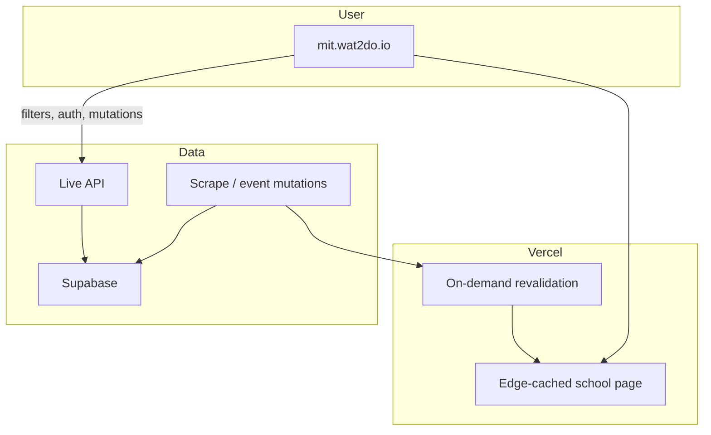

# Event Feed Caching Architecture

## Purpose

Wat2Do serves many schools via subdomains (for example `mit.wat2do.io`,
`uwaterloo.wat2do.io`) and may grow to hundreds of schools.
Each school exposes a default upcoming event feed - the highest-traffic read
path in the product.

This document defines the target architecture for serving that feed as fast
as possible while keeping staleness tied to when data actually changes.

## Problem

Today the frontend is a single SPA deployment.
Users load HTML and JavaScript, then fetch event data from the API at runtime.
Every homepage visit pays that latency cost.

We need an architecture that:

- Scales to hundreds of schools without hundreds of deployments or a massive
  frontend bundle.
- Makes the default school feed feel instant.
- Stays fresh when scrapes or manual edits add or update events.
- Keeps interactive features (filters, search, auth, saved events, CRUD)
  on live backend paths.
- Surfaces when a school's catalog last gained an event, without an extra
  round-trip beyond the default feed fetch.

## Chosen Architecture

**Next.js on Vercel with ISR (Incremental Static Regeneration) and on-demand
revalidation.**

One deployment serves all school subdomains.
Each school gets a cached page at the edge containing its default event feed.
When event data changes for a school, the scrape pipeline triggers revalidation
of that school's cache, not a full redeploy of the entire app.

## Core Design Principles

### One deployment, many schools

Wildcard subdomains map to school context (same model as today).
No per-school Vercel projects.
No embedding all schools' data into one frontend bundle.

### Default feed is pre-rendered

The unfiltered, first-page event list for a school is served from the edge
cache as HTML (events visible before client JavaScript runs).
This is the primary performance win.

### Freshness follows data changes

Staleness is not governed by a fixed timer (for example "always 5 minutes old").
When a scrape or other event mutation completes for a school, revalidation
refreshes that school's cached page.
Other schools are unaffected.

A conservative time-based fallback may exist as a safety net for missed
webhooks, but on-demand revalidation is the primary freshness mechanism.

### Live API for everything else

Filters, search, pagination beyond the first page, authentication, saved
events, and create/update/delete stay on the live backend.
Only the default public browse path is edge-cached.

### Feed metadata travels with the feed

The default event fetch for a school must carry metadata beyond the paginated
event list.
Alongside `items`, the response includes the **most recently added event for
that school**: its **title** and **`added_at` timestamp** (when it entered
the catalog).

The homepage uses that metadata for copy such as "Hack the North added 22
minutes ago."
It is school-scoped catalog freshness, not inferred from whatever events
happen to appear on the first page of the date-sorted feed.

This metadata is part of the same default feed payload as the event list,
not a separate product surface or second fetch.
When a school's cache revalidates, the feed and this freshness metadata
update together.

## What We Are Not Doing

- **All events in the frontend bundle** - does not scale to hundreds of
  schools.
- **Separate deployments per school** - unnecessary operational burden.
- **Relying on fixed API cache TTL as the primary freshness model** - accepts
  arbitrary staleness unrelated to when data changed.
- **A dedicated route or fetch for "last added"** - duplicates cache keys
  and round-trips; metadata belongs on the default feed response.

## Tradeoffs

| Benefit | Cost |
|---|---|
| Fastest first paint for default feed | Requires serving the app from Next.js |
| Per-school freshness without full redeploys | Revalidation webhook and scrape integration |
| Lower API load on homepage views | Filters and dynamic actions still hit the API |
| SEO and shareable event URLs become possible | App Router routes must replace the old SPA shell |

## Success Criteria

- A student landing on a school subdomain sees the default event feed without
  waiting on a live API call for the initial render.
- After a scrape completes for that school, the cached page reflects new
  events within minutes, without redeploying the whole frontend.
- The "last added" line (event title + `added_at`) reflects the same cached
  snapshot as the feed.
- Architecture remains viable at hundreds of schools with one deployment.

## Summary

Serve each school's default event feed from Vercel's edge cache via Next.js
ISR.
Refresh a school's cache on-demand when its event data changes.
Keep dynamic and personalized behavior on the live API.
Ship feed freshness metadata (latest school event title and `added_at`
timestamp) alongside the feed, as one unit.
